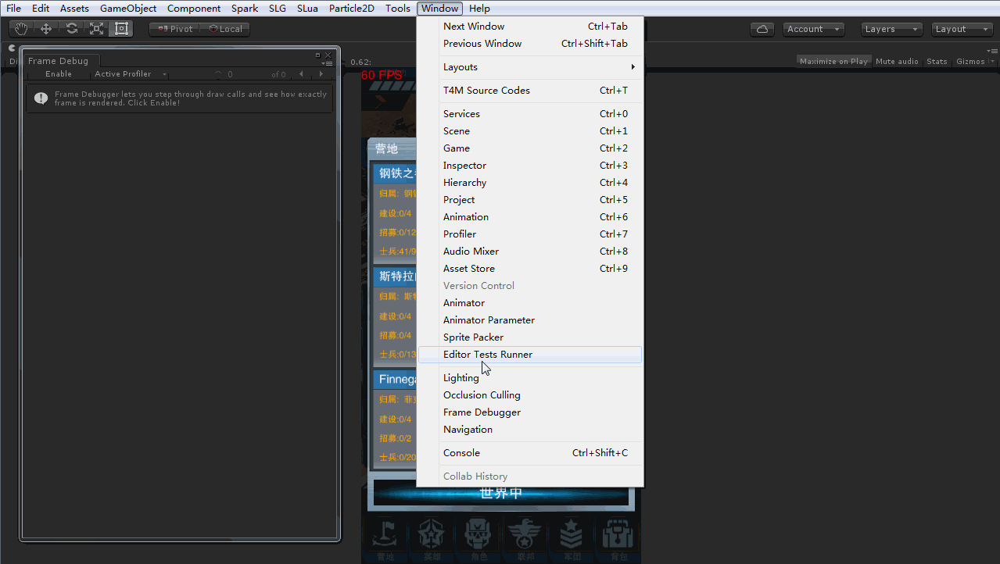

# UnityPedia
- Instantiate(_From Project MathchChapter3_)
```C#
Instantiate(prefab, pos, Quaternion.identity);
```

- [HideInInspector]
  在Inspector视图中隐藏参数

- `CTRL/CMD+SHIFT+F`  将选中对象的局部坐标设定为窗口的的局部坐标，这个快捷键非常有用，当我们需要摆放摄像机的时候，可以先找好视口，然后选中要摆放的摄像机对其使用该快捷键，这样摄像机就和当前的窗口有相同的朝向
- __Rotation function__
```
//Rotation function
	Quaternion rotation = go.transform.rotation;
	rotation *= Quaternion.Euler (0, 0, -90);
	go.transform.rotation = rotation;
```
- Resource.Load("xxx/xxx")中的filePath指的是Assets/Resources之后的部分
- 使用UGUI需要using UnityEngine.UI
- Asset Store上下载的资源默认保存地址。
  - Win _C:\Users\admin\AppData\Roaming\Unity\Asset Store-5.x_ 
  - Mac ~/Library/Unity/Asset Store
- Resources.Load加载资源时，文件名**不写**后缀名
- Unity的QualitySetting中**Blend Weights**中骨骼的数量和**Level**设置会导致模拟器和真机的差异（eg. Dudu猫耳朵动画），调整成最佳效果即可解决问题
- Unity跨平台开发，使用`#if UNITY_IOS ... #endif`等来区别不同平台代码。[平台代码](http://docs.unity3d.com/Manual/PlatformDependentCompilation.html)
- 3D物体世界坐标转屏幕空间坐标**Camera.main.WorldToScreenPoint(position);**
- Frame Debuger 
- [ScrollRect]`verticalNormalizedPosition`滚动框定位	
  > The vertical scroll position as a value between 0 and 1, with 0 being at the bottom.
- `Mathf.RoundToInt`: 返回最接近的整数，距离相同时，返回偶数
- `Time.realtimeSinceStartup`:游戏开始到现在经历的秒数，应用场景：防沉迷计时
- `LayoutRebuilder.ForceRebuildLayoutImmediate`:Forces an immediate rebuild of the layout element and child layout elements affected by the calculations.
